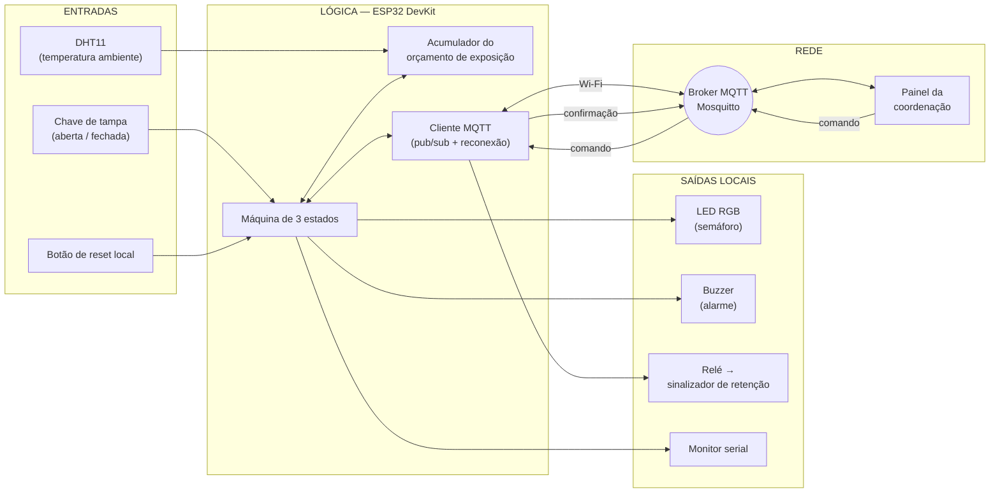
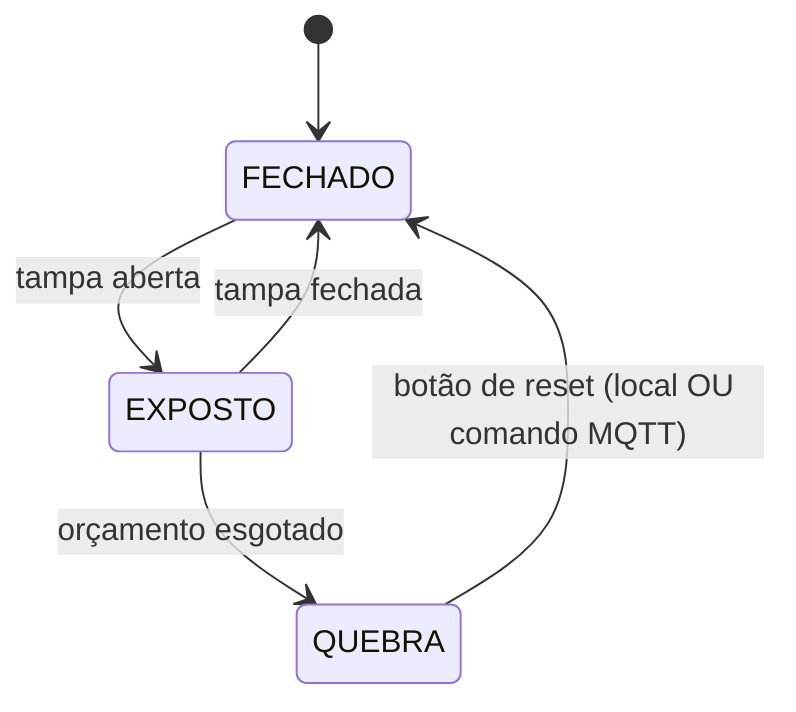

# Sentinela de Cadeia Fria

> **Internet das Coisas - N1** · Prof. Edson Vaz Lopes
> Família temática atribuída: **Temperatura e Cadeia Fria**
> Documento de **aprofundamento (pós Aula 04)** — evolui a entrega da Aula 02 para decisões reais: placa com conectividade, telemetria e comando remoto por MQTT.

Um monitor de campo que mede **quanto tempo e sob que calor** um produto refrigerado ficou exposto durante o manuseio - o trecho da cadeia fria em que hoje ninguém mede nada - e agora **transmite isso em tempo real** para a coordenação, que pode **agir à distância**.

---

## 1. Integrantes

| Integrante | GitHub |
|---|---|
| Victor Henrique Kunz de Souza | `@victorkunzz` |
| Henrique Cordeiro de Oliveira | `@rique1011` |
| Nicholas Scoz dos Santos | `@nicholasscoz` |
| Lucas Rogério Mendonça | `@mendoncaluucas` |
| Kauã Henrique Lucindo | `@lucind0` |
| Vinicius Steuernagel | `@steuer10` |

## 2. Família temática

**Temperatura e Cadeia Fria.**

Dentro dessa família, escolhemos um recorte específico: em vez de monitorar o **equipamento** de refrigeração, monitorar o **manuseio** - o intervalo em que o produto está fora de qualquer equipamento e, portanto, fora de qualquer medição.

## 3. Problema

A cadeia fria é vigiada nas pontas e cega no meio. A geladeira da unidade tem termômetro. O caminhão refrigerado tem termômetro. Mas entre um e outro existe um intervalo sem instrumentação nenhuma: a caixa térmica aberta na calçada enquanto se separa a dose, o produto esperando na bancada durante o preparo, a bolsa deixada ao sol por alguns minutos porque apareceu uma fila.

Esse intervalo não é registrado por ninguém. Quando um lote é descartado por suspeita de quebra de cadeia fria, não há como saber **se falhou o equipamento ou o manuseio** - e, sem saber, não há o que corrigir. O relato disponível é sempre o mesmo: *"acho que ficou uns cinco minutos aberto"*.

O custo não é só o frasco perdido. É a revacinação das pessoas, a viagem repetida, e a dúvida que sobra sobre doses que talvez estivessem boas.

**A evolução desta etapa:** o registro deixa de ser uma anotação de memória no fim do dia e passa a ser **telemetria em tempo real**. A coordenação enxerga o que acontece na bancada de campo enquanto acontece, e pode **sinalizar remotamente** um lote suspeito para retenção, sem depender do relato posterior do técnico.

## 4. Usuário e contexto de uso

**Usuário principal:** o técnico de enfermagem que conduz uma **campanha de vacinação extramuros** - escola, empresa, evento comunitário ou visita domiciliar.

Nesse contexto ele:

- transporta as doses em caixa térmica com bobinas de gelo, longe de qualquer geladeira;
- abre e fecha a tampa dezenas de vezes ao longo do turno, uma por pessoa atendida;
- trabalha ao ar livre, sob temperatura que pode passar de 30 °C;
- preenche o registro de temperatura **de memória**, ao final do dia.

É o cenário com mais aberturas, mais calor e menos instrumentação de toda a cadeia - e por isso o escolhido como piloto.

**Usuário secundário:** a **coordenação da unidade**, que agora deixa de ser apenas leitora de um relatório posterior. Com a telemetria por MQTT, a coordenação:

- acompanha estado, temperatura e orçamento de exposição de cada caixa em tempo real;
- recebe alerta imediato quando uma caixa entra em QUEBRA;
- pode **acionar remotamente** o sinalizador de retenção da caixa suspeita e disparar o alarme sonoro no dispositivo do técnico, para avisá-lo à distância.

## 5. Objetivo da N1

Construir um **protótipo conectado** que:

1. detecte a abertura e o fechamento da tampa da caixa térmica;
2. meça a temperatura do ambiente ao qual o conteúdo fica exposto;
3. acumule um **orçamento de exposição** que se esgota mais rápido quanto mais quente estiver o ambiente;
4. sinalize o estado por um semáforo de três cores e dispare alarme sonoro ao esgotar o orçamento;
5. **publique telemetria e eventos por MQTT** (temperatura, umidade, estado, orçamento, aberturas);
6. **obedeça a comandos remotos** da coordenação (disparar/silenciar alarme, resetar quebra, ligar/desligar o sinalizador de retenção), **confirmando cada comando** de volta;
7. **sobreviva a quedas de rede**, reconectando Wi-Fi e broker automaticamente e sinalizando ausência via *Last Will*;
8. registre cada evento também no monitor serial, com duração e temperatura média.

O que **não** é objetivo da N1: medir a temperatura interna da caixa com precisão metrológica, ou persistir histórico no próprio dispositivo sem broker. As razões estão em [Limitações assumidas](#12-limitações-assumidas-nesta-etapa).

## 6. Componentes previstos

O projeto **migra da BlackBoard UNO R3 para o ESP32**, que traz Wi-Fi nativo - a mudança que viabiliza todo o requisito de conectividade da N1. O restante do arranjo (DHT11, semáforo, buzzer, chaves) é preservado.

| Componente | Modelo / especificação | Função no projeto | Situação |
|---|---|---|---|
| **ESP32 DevKit V1** | Dual-core 240 MHz, Wi-Fi 2,4 GHz, ADC 12 bits | Controlador + conectividade | ❌ **a adquirir** (fora do kit) |
| Sensor DHT11 | digital, ±2 °C, 1 leitura/s | Temperatura e umidade do ambiente | ✅ no kit |
| LED RGB | cátodo/ânodo comum (a confirmar) | Semáforo de estado (verde / amarelo / vermelho) | ✅ no kit |
| Chave momentânea | tátil 6 mm | Sensor de tampa aberta | ✅ no kit |
| Chave momentânea (2ª) | tátil 6 mm | Botão de reset local após quebra | ✅ no kit |
| Buzzer | ativo ou passivo (a confirmar) | Alarme sonoro (local **e** comandável) | ✅ no kit |
| **Módulo relé 1 canal** | 5 V, opto-isolado, saída a seco | Aciona o **sinalizador de retenção** (comando remoto) | ❌ **a adquirir** |
| **Sinalizador de retenção** | lâmpada/torre de sinalização 5–12 V | Marca fisicamente a caixa "sob suspeita, reter" | ❌ **a adquirir** |
| Fonte / alimentação | USB 5 V ou bateria + regulador 3,3 V | Alimentação do ESP32 e periféricos | ⚠️ definir (bancada USB na N1) |
| Protoboard 400 pontos + jumpers | — | Montagem | ✅ no kit |
| Resistores | 220–330 Ω (LED RGB) | Limitação de corrente do LED RGB | ⚠️ conferir valores disponíveis |
| Termômetro digital de referência | resposta rápida | Validar o DHT11 (ver risco 01) | ❌ **não temos - providenciar** |
| Caixa térmica pequena | — | Corpo do protótipo | ❌ a providenciar pelo grupo |

Conferir o inventário completo e o que falta adquirir é a tarefa 3 do backlog.

> **Sensor real:** DHT11 (o do kit), com plano B de troca condicionado ao experimento do RISCO-01.
> **Atuadores reais:** (a) **buzzer + LED RGB** como alerta local, agora também comandáveis remotamente; (b) **relé acionando o sinalizador de retenção**, atuador físico novo, comandado exclusivamente por MQTT com confirmação.

## 7. Arquitetura específica do projeto

Fluxo completo, das entradas físicas ao painel da coordenação, passando pelo broker MQTT.



### Tópicos MQTT (nomes reais)

Prefixo base do dispositivo: **`sentinela/cadeia-fria`**. QoS 1 para comandos e confirmações, QoS 0 para telemetria periódica.

| Direção | Tópico | Payload | Uso |
|---|---|---|---|
| 📤 device → broker | `sentinela/cadeia-fria/telemetria` | JSON: `temp`, `umid`, `estado`, `orcamento`, `aberturas`, `rssi` | Telemetria periódica (a cada 5 s) |
| 📤 device → broker | `sentinela/cadeia-fria/evento` | JSON: `evento`, `dur_s`, `t_med`, `consumo`, `restante` | Eventos discretos (abertura, fechamento, quebra, reset) |
| 📤 device → broker | `sentinela/cadeia-fria/status` | `online` / `offline` (retained, via *Last Will*) | Presença — base da detecção de reconexão |
| 📥 broker → device | `sentinela/cadeia-fria/comando/alarme` | JSON: `{"acao":"disparar"\|"silenciar"}` | Coordenação aciona/silencia o buzzer à distância |
| 📥 broker → device | `sentinela/cadeia-fria/comando/reset` | JSON: `{"acao":"reset"}` | Reconhece/reseta a QUEBRA remotamente |
| 📥 broker → device | `sentinela/cadeia-fria/comando/rele` | JSON: `{"acao":"ligar"\|"desligar"}` | Liga/desliga o **sinalizador de retenção** |
| 📤 device → broker | `sentinela/cadeia-fria/confirmacao` | JSON: `comando`, `acao`, `executado`, `estado_resultante` | **ACK** de cada comando recebido |

> O tópico `sentinela/cadeia-fria/comando/rele` é o análogo direto do exemplo `grupoX/comando/rele` do enunciado.

### Máquina de estados



| Estado | Semáforo | Buzzer | O que acontece |
|---|---|---|---|
| **FECHADO** | 🟢 verde | silencioso | orçamento preservado |
| **EXPOSTO** | 🟡 amarelo | silencioso | orçamento sendo consumido |
| **QUEBRA** | 🔴 vermelho | alarme | estado travado; sai por reset **local ou remoto**, e o reset é registrado e publicado |

O relé (sinalizador de retenção) é **ortogonal à máquina de estados**: é ligado/desligado apenas por comando remoto da coordenação, independente do estado local. Isso é proposital — permite marcar para retenção mesmo uma caixa que já voltou ao verde.

### O orçamento de exposição

O aparelho não conta apenas segundos, conta **segundos ponderados pelo calor**. Um minuto de tampa aberta numa sala a 20 °C não agride o produto do mesmo modo que um minuto na calçada a 33 °C.

```
consumo por segundo = 1 + (T_ambiente − 20 °C) / 10
```

A 20 °C consome 1 unidade por segundo; a 30 °C, 2 unidades; a 40 °C, 3. O orçamento total parte de um valor provisório de **120 unidades**, equivalente a dois minutos abertos em ambiente ameno.

> **O número 120 é provisório e não tem respaldo externo ainda.** Redefini-lo com base em referência real é a tarefa 9 do backlog, e é a primeira dúvida dirigida ao professor.

### Pinagem preliminar (ESP32)

A confirmar na bancada (tarefa 4 do backlog). No ESP32 **qualquer GPIO pode gerar PWM** via periférico LEDC, então a escolha de pinos é mais livre que na UNO - evitamos apenas os pinos de *boot/strapping* e os *input-only*.

| GPIO | Componente | Observação |
|---|---|---|
| GPIO4 | DHT11 (dados) | pull-up de 10 kΩ recomendado |
| GPIO18 | Chave de tampa | `INPUT_PULLUP` |
| GPIO19 | Botão de reset local | `INPUT_PULLUP` |
| GPIO27 | Buzzer | LEDC/`tone` — conferir se ativo ou passivo |
| GPIO25 / GPIO26 / GPIO33 | LED RGB — vermelho / verde / azul | LEDC (PWM) |
| GPIO23 | Relé (sinalizador de retenção) | saída digital; relé opto-isolado |
| (ADC1: GPIO34/35/32) | reservado p/ sensor analógico do plano B | ver RISCO-01 revisitado |

Falta confirmar se o LED RGB do kit é de ânodo ou cátodo comum (muda a lógica de acionamento) e se o relé é acionado em nível alto ou baixo.

📄 Detalhamento do firmware e da camada MQTT em [`docs/arquitetura-inicial.md`](docs/arquitetura-inicial.md) e [`docs/arquitetura-mqtt.md`](docs/arquitetura-mqtt.md).

## 8. Protótipo do produto

Rascunho visual do que está sendo construído — o arranjo físico na caixa térmica **e** o painel que a coordenação vê. Detalhamento e wireframes em [`docs/prototipo.md`](docs/prototipo.md).

```
   ARRANJO FÍSICO (bancada de campo)              PAINEL DA COORDENAÇÃO (MQTT)
   ┌───────────────────────────────┐             ┌──────────────────────────────┐
   │  CAIXA TÉRMICA                 │             │  SENTINELA · Caixa CF-01     │
   │   ┌──────────────┐            │   Wi-Fi     │  Estado:  🟡 EXPOSTO         │
   │   │ tampa ┄┄ chave│───┐        │ ~~~~~~~~►  │  Temp:    31.2 °C  UR 58%    │
   │   └──────────────┘   │ ESP32  │   MQTT      │  Orçamento: ▓▓▓▓░░░░ 44.8    │
   │   [DHT11]  🟢🟡🔴 LED │  +     │             │  Aberturas hoje: 2           │
   │   [buzzer]  [relé]────┼─► 🚨   │             │  [ Disparar alarme ]         │
   │                       │ farol  │             │  [ Reset remoto ]            │
   │   [botão reset]───────┘        │             │  [ Ligar sinalizador ⏻ ]     │
   └───────────────────────────────┘             └──────────────────────────────┘
```

## 9. Backlog

Cada tarefa carrega um critério de conclusão verificável, o "pronto quando". O backlog cobre **todos os requisitos mínimos da N1**: sensor, atuador, circuito, Wi-Fi, MQTT, tópico de comando, confirmação, reconexão, documentação e demonstração.

| # | Tarefa | Requisito N1 | Responsável | Pronto quando | Status |
|---|---|---|---|---|---|
| 1 | Criar repositório e adicionar colaboradores | documentação | Victor | todos conseguem dar push | ✅ concluída |
| 2 | README inicial (Aula 02) | documentação | Victor | os 10 itens exigidos presentes | ✅ concluída |
| 3 | Conferir e fotografar o kit + listar o que falta comprar | hardware | A definir | lista com quantidades em `docs/` | ⬜ A fazer |
| 4 | Semáforo (LED RGB) nas 3 cores no ESP32 | atuador / circuito | A definir | 3 cores alternam em sequência de 1 s | ⬜ A fazer |
| 5 | Ler o DHT11 e imprimir T e UR no serial | sensor | A definir | 10 leituras plausíveis, 1/s | ⬜ A fazer |
| 6 | Ler a chave de tampa com debounce | circuito | A definir | 20 aberturas geram exatamente 20 eventos | ⬜ A fazer |
| 7 | Conectar o ESP32 ao Wi-Fi com reconexão | **Wi-Fi / reconexão** | A definir | derruba o AP e o ESP reconecta sozinho < 15 s | ⬜ A fazer |
| 8 | Publicar telemetria e eventos no broker MQTT | **MQTT** | A definir | painel recebe telemetria a cada 5 s | ⬜ A fazer |
| 9 | Assinar `comando/*` e executar com confirmação | **tópico de comando / confirmação** | A definir | comando de relé liga o sinalizador e volta ACK | ⬜ A fazer |
| 10 | *Last Will* (`status=offline`) + reconexão MQTT | **reconexão** | A definir | matar o device marca `offline` no painel < 10 s | ⬜ A fazer |
| 11 | Máquina de 3 estados integrando tudo | circuito / lógica | A definir | ciclo FECHADO→EXPOSTO→QUEBRA→reset validado | 📝 Rascunho a validar |
| 12 | Relé + sinalizador de retenção comandado por MQTT | **atuador** | A definir | comando remoto liga/desliga o farol com ACK | ⬜ A fazer |
| 13 | Medir o tempo de resposta do DHT11 (RISCO-01) | risco | Nicholas / Vinicius | tabela tempo × temperatura + conclusão | ⬜ A fazer |
| 14 | Definir o limite de exposição com fonte externa | documentação | A definir | número no README com referência citada | ⬜ A fazer |
| 15 | Padrão sonoro do alarme no buzzer | atuador | A definir | distinguível de um bipe comum a 2 m | ⬜ A fazer |
| 16 | Roteiro de demonstração da N1 | **demonstração** | A definir | passo a passo que exercita todos os requisitos | ⬜ A fazer |

**Legenda:** ⬜ não iniciada · 🔄 em andamento · 📝 rascunho existe, aguardando validação · ✅ concluída

## 10. Primeiro risco técnico (revisitado)

O risco registrado na Aula 02 **continua sendo o principal** e foi revisto à luz de eletrônica (Aula 03) e ADC (Aula 04). Um segundo risco foi aberto pela decisão de conectividade.

### RISCO-01 — O DHT11 pode ser lento demais para o que o projeto mede *(mantido, atualizado)*

O projeto mede exposições de **30 a 60 segundos**; o DHT11 entrega **1 leitura/s**, resolução de 1 °C e erro de ±2 °C, além de inércia térmica do encapsulamento. Se essa inércia for de dezenas de segundos, a temperatura média sai **subestimada** e o orçamento consome devagar demais — uma **falha silenciosa**.

**Atualização à luz da Aula 03/04:** o plano B (trocar o DHT11) hoje é mais barato com o ESP32. As alternativas analógicas (**LM35, termistor NTC**) passam a usar o **ADC do ESP32**, e aí entram considerações de Aula 04: o ADC do ESP32 é de 12 bits mas **não-linear nas extremidades** e precisa de **calibração** (curva/atenuação) para virar temperatura confiável. O **DS18B20** (digital, 1-Wire) evita o ADC por completo e continua sendo a primeira opção do plano B.

📄 Protocolo completo, critério de decisão e plano B em [`docs/risco-01-dht11.md`](docs/risco-01-dht11.md).

### RISCO-02 — Disponibilidade de rede em campo *(novo, criado pela conectividade)*

A conectividade que a N1 exige colide com a realidade do uso extramuros: **escola, calçada e visita domiciliar raramente têm Wi-Fi disponível**. Se o dispositivo depender de uma rede que não existe no local, a telemetria fica muda justamente onde ela mais importa.

**Decisão para a N1:** o protótipo é validado em bancada com **broker Mosquitto local** (PC/Raspberry Pi) sobre Wi-Fi controlado. Em campo, o caminho previsto é **hotspot do celular do técnico**; store-and-forward (buffer local até reconectar) fica como evolução da N2. É por isso que a reconexão automática e o *Last Will* são requisitos de primeira classe, e não detalhe — a rede **vai** cair, e o sistema precisa se comportar quando isso acontecer.

## 11. Feedback da Aula 04

> ⚠️ **Seção a preencher pela equipe.** Registrar aqui, em poucas frases, o que o professor observou ou perguntou na conversa individual desta aula, e como isso confirma ou muda o plano. *(O conteúdo abaixo é um modelo — substituir pelo retorno real.)*

- **O que o professor observou/perguntou:** _(preencher)_
- **O que isso confirma no nosso plano:** _(preencher)_
- **O que muda a partir disso:** _(preencher)_

## 12. Limitações assumidas nesta etapa

Registradas de propósito, são escolhas conscientes, não esquecimentos.

- **Rede dependente de infraestrutura local.** A N1 assume um broker Mosquitto acessível por Wi-Fi (bancada) ou hotspot (campo). O funcionamento *offline com buffer* fica declarado como evolução da N2 — ver RISCO-02.
- **Sem persistência no dispositivo.** Não há cartão SD nem RTC no arranjo. O histórico vive no broker/painel; os tempos do device são relativos à energização (`millis()`), não a um relógio real.
- **Não medimos a temperatura interna da caixa.** O DHT11 não opera abaixo de 0 °C e tem erro de ±2 °C — maior que a tolerância de +2 a +8 °C. Medir o ambiente de exposição, onde o sensor está dentro da especificação, é decisão técnica deliberada.

## 13. Dúvidas para o professor

1. **Referência para o limite de exposição.** Existe norma/recomendação oficial (PNI, ANVISA) de tempo máximo de caixa térmica aberta que possamos adotar como base, ou definimos uma heurística própria, desde que declarada como tal?
2. **Broker.** Para a N1, é aceitável um broker público de teste (ex.: `test.mosquitto.org`) durante o desenvolvimento, entregando com Mosquitto local na demonstração?
3. **Rede em campo.** O cenário de hotspot do celular é aceitável como resposta ao RISCO-02 na N1, ficando o buffer offline para a N2?
4. **Rigor do modelo.** O "orçamento de exposição" é uma simplificação nossa da carga térmica. Basta estar declarado abertamente como heurística assumida?
