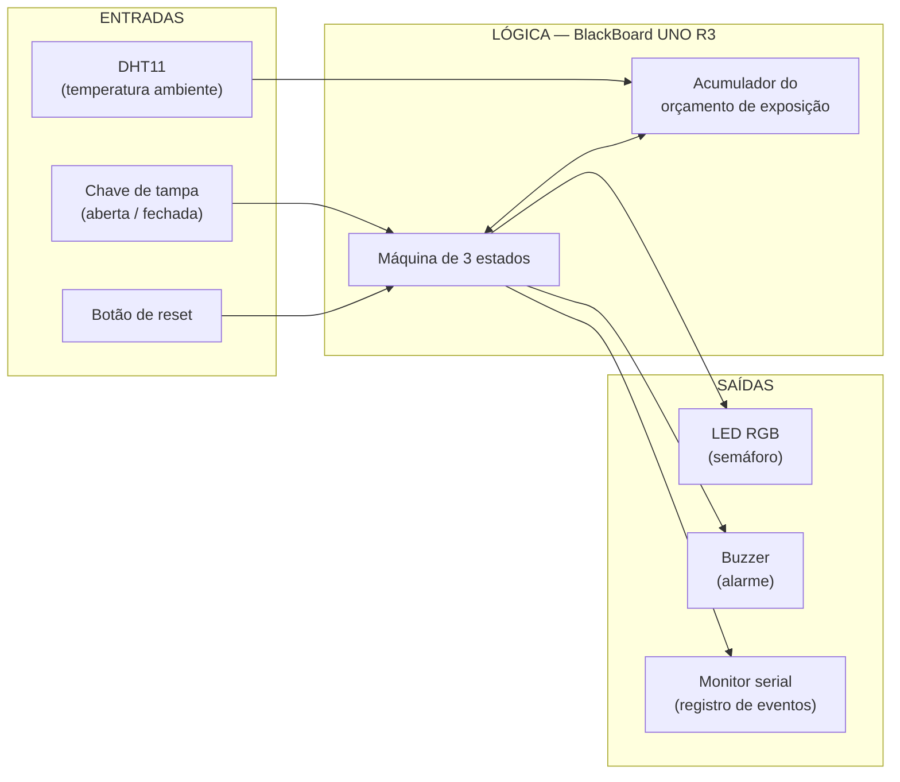
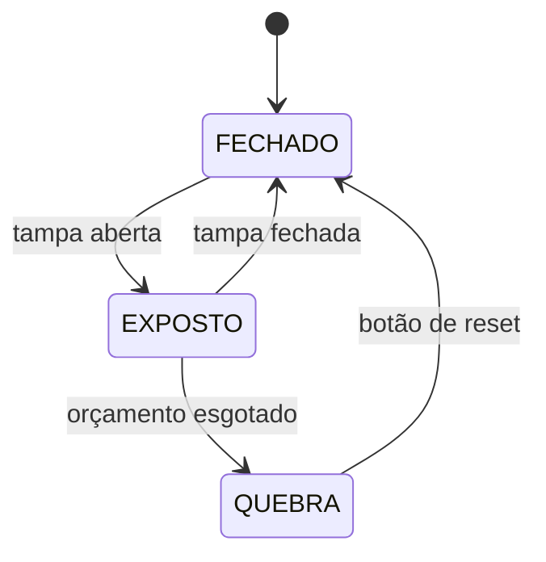

# Sentinela de Cadeia Fria

> **Internet das Coisas - N1** · Prof. Edson Vaz Lopes  
> Família temática atribuída: **Temperatura e Cadeia Fria**

Um monitor de bancada que mede **quanto tempo e sob que calor** um produto refrigerado ficou exposto durante o manuseio - o trecho da cadeia fria em que hoje ninguém mede nada.

---

## 1. Integrantes

| Integrante | GitHub |
|---|---|
| Victor Henrique Kunz de Souza | `@victorkunzz` |
| Henrique Cordeiro de Oliveira | `@rique1011` |
| Nicholas Scoz dos Santos | `@nicholasscoz` |
| Lucas Rogério Mendonça | `@mendoncaluucas` |
| Kauã Henrique Lucindo | `@lucind0` |
| Vinicius Steuernagel | `@steuer10` |

## 2. Família temática

**Temperatura e Cadeia Fria.**

Dentro dessa família, escolhemos um recorte específico: em vez de monitorar o **equipamento** de refrigeração, monitorar o **manuseio** - o intervalo em que o produto está fora de qualquer equipamento e, portanto, fora de qualquer medição.

## 3. Problema

A cadeia fria é vigiada nas pontas e cega no meio. A geladeira da unidade tem termômetro. O caminhão refrigerado tem termômetro. Mas entre um e outro existe um intervalo sem instrumentação nenhuma: a caixa térmica aberta na calçada enquanto se separa a dose, o produto esperando na bancada durante o preparo, a bolsa deixada ao sol por alguns minutos porque apareceu uma fila.

Esse intervalo não é registrado por ninguém. Quando um lote é descartado por suspeita de quebra de cadeia fria, não há como saber **se falhou o equipamento ou o manuseio** - e, sem saber, não há o que corrigir. O relato disponível é sempre o mesmo: *"acho que ficou uns cinco minutos aberto"*.

O custo não é só o frasco perdido. É a revacinação das pessoas, a viagem repetida, e a dúvida que sobra sobre doses que talvez estivessem boas.

## 4. Usuário e contexto de uso

**Usuário principal:** o técnico de enfermagem que conduz uma **campanha de vacinação extramuros** - escola, empresa, evento comunitário ou visita domiciliar.

Nesse contexto ele:

- transporta as doses em caixa térmica com bobinas de gelo, longe de qualquer geladeira;
- abre e fecha a tampa dezenas de vezes ao longo do turno, uma por pessoa atendida;
- trabalha ao ar livre, sob temperatura que pode passar de 30 °C;
- preenche o registro de temperatura **de memória**, ao final do dia.

É o cenário com mais aberturas, mais calor e menos instrumentação de toda a cadeia - e por isso o escolhido como piloto.

**Usuário secundário:** a coordenação da unidade, que precisa de um registro objetivo para decidir se um lote deve ou não ser descartado.

## 5. Objetivo da N1

Construir um **protótipo de bancada** que:

1. detecte a abertura e o fechamento da tampa da caixa térmica;
2. meça a temperatura do ambiente ao qual o conteúdo fica exposto;
3. acumule um **orçamento de exposição** que se esgota mais rápido quanto mais quente estiver o ambiente;
4. sinalize o estado por um semáforo de três cores e dispare alarme sonoro ao esgotar o orçamento;
5. registre cada evento no monitor serial, com duração e temperatura média.

O que **não** é objetivo da N1: medir a temperatura interna da caixa com precisão metrológica, enviar dados pela rede, ou armazenar histórico sem o computador conectado. As razões estão em [Limitações assumidas](#11-limitações-assumidas-nesta-etapa).

## 6. Componentes previstos

Todos do **Kit Iniciante V8 — RoboCore**, salvo indicação contrária.

| Componente | Função no projeto | Situação |
|---|---|---|
| BlackBoard UNO R3 | Controlador | ✅ no kit |
| Sensor DHT11 | Temperatura e umidade do ambiente | ✅ no kit |
| LED RGB | Semáforo de estado (verde / amarelo / vermelho) | ✅ no kit |
| Chave momentânea | Sensor de tampa aberta | ✅ no kit |
| Chave momentânea (2ª) | Botão de reset após quebra | ✅ no kit |
| Buzzer | Alarme sonoro de quebra | ✅ no kit |
| Protoboard 400 pontos + jumpers | Montagem | ✅ no kit |
| Resistores | Limitação de corrente do LED RGB | ⚠️ conferir valores disponíveis |
| Potenciômetro | Ajuste do limite sem recompilar (desejável) | ⚠️ a confirmar no kit |
| Display LCD/OLED | Leitura sem notebook (desejável) | ⚠️ a confirmar no kit |
| Termômetro digital de referência | Validar o DHT11 (ver risco 01) | ❌ **não temos - precisa providenciar** |
| Caixa térmica pequena | Corpo do protótipo | ❌ a providenciar pelo grupo |

Conferir o inventário completo é a tarefa 3 do backlog.

## 7. Arquitetura inicial



### Máquina de estados



| Estado | Semáforo | Buzzer | O que acontece |
|---|---|---|---|
| **FECHADO** | 🟢 verde | silencioso | orçamento preservado |
| **EXPOSTO** | 🟡 amarelo | silencioso | orçamento sendo consumido |
| **QUEBRA** | 🔴 vermelho | alarme | estado travado; só sai por reset, e o reset é registrado |

### O orçamento de exposição

O aparelho não conta apenas segundos, conta **segundos ponderados pelo calor**. Um minuto de tampa aberta numa sala a 20 °C não agride o produto do mesmo modo que um minuto na calçada a 33 °C.

```
consumo por segundo = 1 + (T_ambiente − 20 °C) / 10
```

A 20 °C consome 1 unidade por segundo; a 30 °C, 2 unidades; a 40 °C, 3. O orçamento total parte de um valor provisório de **120 unidades**, equivalente a dois minutos abertos em ambiente ameno.

> **O número 120 é provisório e não tem respaldo externo ainda.** Redefini-lo com base em referência real é a tarefa 8 do backlog, e é assunto da primeira dúvida dirigida ao professor.

### Ligações preliminares

A confirmar na bancada (tarefa 4 do backlog).

| Pino | Componente |
|---|---|
| D2 | DHT11 (dados) |
| D3 | Chave de tampa (`INPUT_PULLUP`) |
| D4 | Botão de reset (`INPUT_PULLUP`) |
| D8 | Buzzer |
| D9 / D10 / D11 | LED RGB — vermelho / verde / azul (pinos PWM) |

Falta confirmar se o LED RGB do kit é de ânodo ou cátodo comum, muda a lógica de acionamento.

📄 Detalhamento em [`docs/arquitetura-inicial.md`](docs/arquitetura-inicial.md).

## 8. Backlog inicial

Cada tarefa carrega um critério de conclusão verificável, o "pronto quando".

| # | Tarefa | Responsável | Pronto quando | Status |
|---|---|---|---|---|
| 1 | Criar repositório e adicionar colaboradores | Victor | todos os integrantes conseguem dar push | ✅ concluída |
| 2 | Preencher README inicial | Victor | os 10 itens exigidos estão presentes | ✅ concluída |
| 3 | Conferir e fotografar o conteúdo do kit | A definir | lista com quantidades publicada em `docs/` | ⬜ A fazer |
| 4 | Acender o semáforo (LED RGB) nas 3 cores | A definir | as 3 cores alternam em sequência de 1 s | ⬜ A fazer |
| 5 | Ler o DHT11 e imprimir T e UR no serial | A definir | 10 leituras plausíveis, uma por segundo | ⬜ A fazer |
| 6 | Ler a chave de tampa com debounce | A definir | 20 aberturas geram exatamente 20 eventos | ⬜ A fazer |
| 7 | Medir o tempo de resposta do DHT11 (risco 01) | A definir | tabela tempo × temperatura + conclusão escrita | ⬜ A fazer |
| 8 | Definir o limite de exposição com base em fonte externa | A definir | número no README com a referência citada | ⬜ A fazer |
| 9 | Desenhar a máquina de estados | A definir | diagrama dos 3 estados publicado em `docs/` | 📝 Rascunho a validar |
| 10 | Registrar o risco 01 com plano de investigação | A definir | experimento, critério de decisão e plano B descritos | 📝 Rascunho a validar |
| 11 | Listar componentes e o que falta adquirir | A definir | tabela completa na seção 6 | 📝 Rascunho a validar (depende da 3) |
| 12 | Definir o padrão sonoro do alarme no buzzer | A definir | distinguível de um bipe comum a 2 m de distância | ⬜ A fazer |

**Legenda:** ⬜ não iniciada · 🔄 em andamento · 📝 rascunho existe, aguardando validação do responsável · ✅ concluída

## 9. Primeiro risco técnico

### RISCO-01 — O DHT11 pode ser lento demais para o que o projeto se propõe a medir

O projeto mede exposições que duram de **30 a 60 segundos**. O DHT11 entrega **uma leitura por segundo**, com **resolução de 1 °C** e **erro de ±2 °C** — e, além disso, tem inércia térmica própria: o encapsulamento plástico precisa aquecer antes que o elemento sensor registre a mudança.

Se essa inércia for da ordem de dezenas de segundos, a temperatura média de uma exposição curta sairá **subestimada**. O orçamento consumiria mais devagar do que deveria e o aparelho declararia "tudo bem" numa situação de risco real. É uma **falha silenciosa** — o pior tipo, porque não avisa que errou.

**Como vamos investigar:** submeter o sensor a um degrau térmico controlado, medindo em paralelo com um termômetro de referência, e cronometrar quanto tempo ele leva para acompanhar a mudança.

**Critério de decisão:** se o sensor levar mais de 30 s para cobrir 90 % do degrau, ou se o erro na média de 60 s passar de 2 °C, o DHT11 é considerado inadequado e passamos ao plano B (DS18B20 ou LM35, ambos externos ao kit).

📄 Protocolo completo em [`docs/risco-01-dht11.md`](docs/risco-01-dht11.md).

## 10. Dúvidas para o professor

1. **Referência para o limite de exposição.** Existe norma ou recomendação oficial (PNI, ANVISA) de tempo máximo de caixa térmica aberta que possamos adotar como base? Ou definimos uma heurística própria, desde que declarada como tal?
2. **Persistência do registro.** O registro pelo monitor serial é suficiente para a N1, ou espera-se que o dispositivo grave os eventos sem depender de um computador conectado?
3. **Componentes fora do kit.** Se o experimento do risco 01 condenar o DHT11, podemos incorporar um sensor externo ao kit (DS18B20 ou LM35) na N2?
4. **Rigor do modelo.** O "orçamento de exposição" é uma simplificação nossa do conceito de carga térmica. Ele precisa de validação formal, ou basta estar declarado abertamente como heurística assumida?

## 11. Limitações assumidas nesta etapa

Registradas aqui de propósito, são escolhas conscientes, não esquecimentos.

- **Sem conectividade.** A BlackBoard UNO R3 não tem Wi-Fi. A N1 é offline por restrição de hardware; a telemetria fica como evolução declarada.
- **Sem persistência.** Não há cartão SD nem relógio de tempo real no kit. O histórico existe enquanto o serial estiver aberto, e os tempos são relativos à energização da placa.
- **Não medimos a temperatura interna da caixa.** O DHT11 não opera abaixo de 0 °C e tem erro de ±2 °C — maior do que a tolerância da faixa de +2 a +8 °C. Medir o ambiente de exposição, onde o sensor está dentro da especificação, é uma decisão técnica deliberada e não um contorno de conveniência.
