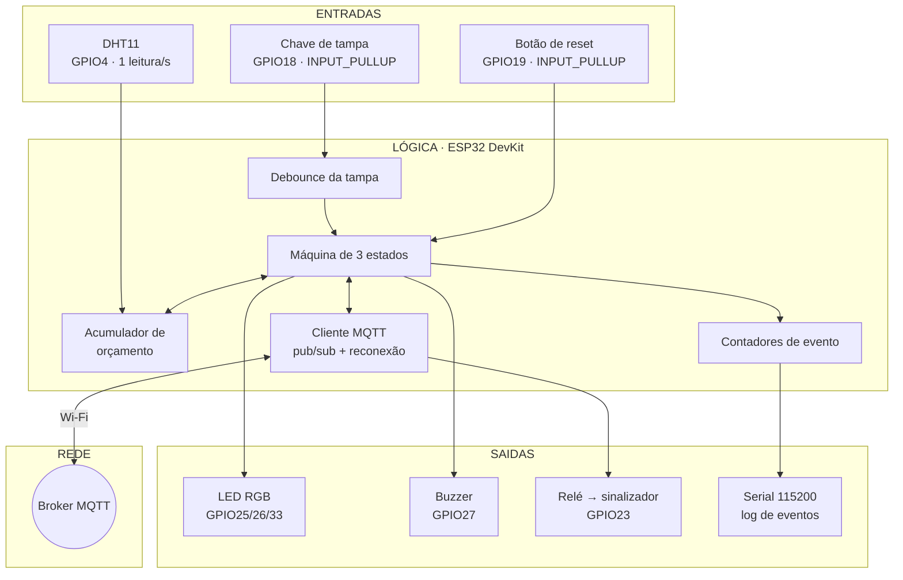
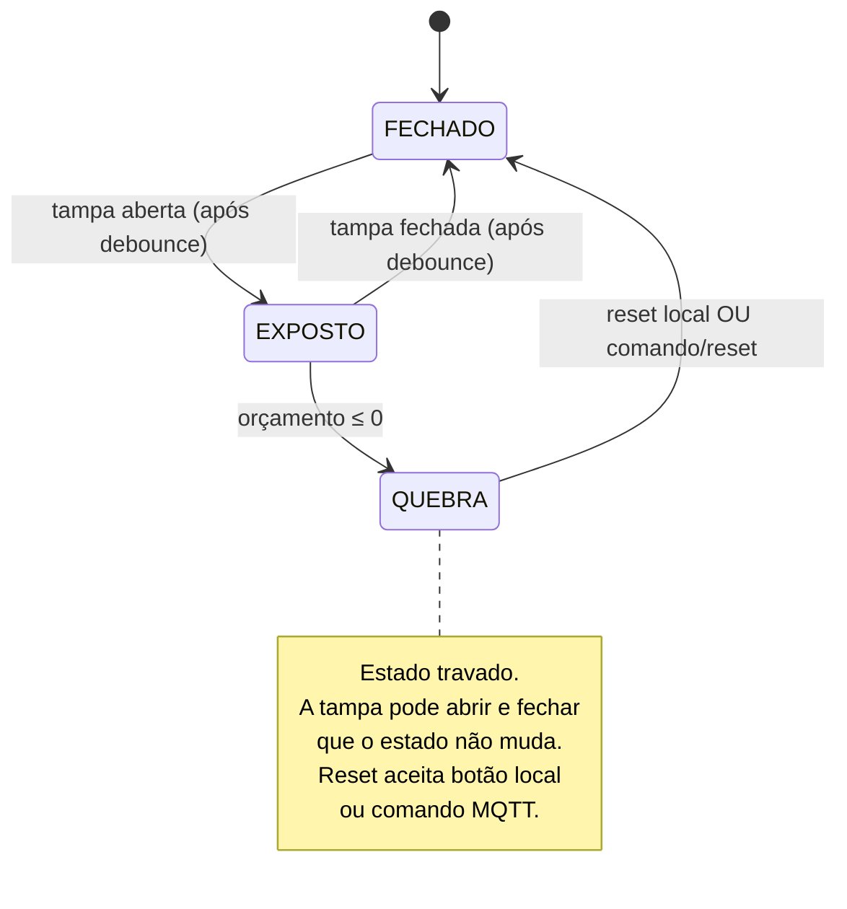

# Arquitetura inicial — Sentinela de Cadeia Fria

Detalhamento da seção 7 do [README](../README.md). Tudo aqui é **preliminar**: nada foi montado em bancada ainda. A camada de rede (MQTT, reconexão, formatos de mensagem) tem documento próprio em [`arquitetura-mqtt.md`](arquitetura-mqtt.md).

## Visão geral

Um laço de controle principal no **ESP32**, sem interrupções, com duas responsabilidades acopladas: a **máquina de estados local** (que funciona mesmo sem rede) e o **cliente MQTT** (telemetria + comandos). O serial continua servindo para registro e depuração; a autonomia local é preservada — se a rede cair, o semáforo, o buzzer e a máquina de estados seguem funcionando.



## Máquina de estados



### Detalhamento

| Estado | LED RGB | Buzzer | Orçamento | Saída do estado |
|---|---|---|---|---|
| **FECHADO** | verde fixo | silencioso | preservado | abertura da tampa |
| **EXPOSTO** | amarelo fixo | silencioso | sendo consumido | fechamento da tampa **ou** esgotamento |
| **QUEBRA** | vermelho piscando | alarme intermitente | zerado | botão de reset local **ou** `comando/reset` |

Três decisões deliberadas:

**O orçamento não se recupera sozinho.** Uma vez consumido, permanece consumido até o reset. Modelar recuperação térmica exigiria conhecer a inércia da caixa, e não conhecemos. Fica como evolução na N2.

**A quebra trava.** Um alarme que se apaga sozinho quando a tampa fecha seria ignorado em campo. O operador (ou a coordenação, remotamente) precisa reconhecer o evento — e esse reconhecimento fica registrado e publicado.

**O relé é independente da máquina de estados.** O sinalizador de retenção só liga/desliga por comando remoto. Não faz parte do ciclo local — permite marcar para retenção mesmo uma caixa que já voltou ao verde.

## Orçamento de exposição

```
consumo(T) = 1 + (T − 20 °C) / 10        [unidades por segundo, mínimo 0]

orçamento inicial = 120 unidades          (PROVISÓRIO — ver tarefa 14)
```

| Temperatura ambiente | Consumo por segundo | Tempo até a quebra |
|---|---|---|
| 20 °C | 1,0 | 120 s |
| 25 °C | 1,5 | 80 s |
| 30 °C | 2,0 | 60 s |
| 35 °C | 2,5 | 48 s |
| 40 °C | 3,0 | 40 s |

A tabela é a melhor forma de explicar o conceito para quem não é da área: **na sombra você tem dois minutos, no sol você tem quarenta segundos.**

> O valor de 120 unidades é um chute educado. Substituí-lo por um número com respaldo é a tarefa 14, e é a dúvida nº 1 dirigida ao professor.

## Esboço do laço principal

Pseudocódigo, não é código final — a implementação é o trabalho das próximas aulas. A rede é tratada de forma **não bloqueante**: se o broker estiver fora, a lógica local não trava.

```
setup:
    configurar pinos
    orcamento = ORCAMENTO_INICIAL
    estado = FECHADO
    conectar_wifi()                 // com timeout, não bloqueia para sempre
    mqtt.set_last_will(status, "offline", retained=true)
    conectar_mqtt()                 // assina comando/alarme, comando/reset, comando/rele
    publicar(status, "online", retained=true)

loop:
    mqtt.tratar()                   // processa comandos recebidos (callback)
    se !wifi_ok:   reconectar_wifi_nao_bloqueante()
    se !mqtt_ok:   reconectar_mqtt_com_backoff()

    a cada 1 s:
        T = ler_dht11()
        tampa = ler_chave_com_debounce()

        se estado == FECHADO:
            se tampa aberta:
                estado = EXPOSTO
                registrar e publicar ABERTURA

        senão se estado == EXPOSTO:
            orcamento -= max(0, 1 + (T - 20) / 10)
            acumular T para a média
            se tampa fechada:
                estado = FECHADO
                registrar e publicar FECHAMENTO (duração, T média, restante)
            senão se orcamento <= 0:
                estado = QUEBRA
                registrar e publicar QUEBRA

        senão se estado == QUEBRA:
            piscar vermelho + buzzer
            se botão de reset local pressionado:
                resetar()           // mesma rotina do comando/reset

        atualizar semáforo

    a cada 5 s:
        publicar TELEMETRIA (T, UR, estado, orcamento, aberturas, rssi)

// callbacks de comando (assíncronos, disparados pelo mqtt.tratar):
ao_receber(comando/alarme, acao):  disparar/silenciar buzzer ; publicar CONFIRMACAO
ao_receber(comando/reset):         resetar()                 ; publicar CONFIRMACAO
ao_receber(comando/rele, acao):    ligar/desligar rele       ; publicar CONFIRMACAO

resetar():
    orcamento = ORCAMENTO_INICIAL
    estado = FECHADO
    registrar e publicar RESET (origem: local | remoto)
```

## Formato do registro serial

Uma linha por evento, legível sem ferramenta nenhuma (espelha o que vai para o MQTT):

```
[00:00:00] INICIO           T=24C UR=55% orcamento=120.0  wifi=OK mqtt=OK
[00:01:12] ABERTURA   #1
[00:01:45] FECHAMENTO #1    dur=33s  Tmed=26.4C  consumo=42.1  restante=77.9
[00:03:02] ABERTURA   #2
[00:03:50] FECHAMENTO #2    dur=48s  Tmed=31.2C  consumo=101.8 restante=0.0
[00:03:50] QUEBRA           aberturas=2  exposicao_total=81s  Tmed=29.3C
[00:04:10] CMD RELE ligar   origem=coordenacao -> sinalizador ON (ack enviado)
[00:05:10] RESET            origem=remoto (comando/reset)
```

Os tempos são relativos à energização da placa (`millis()`), não a um relógio real — não há RTC no arranjo. Correlacionar com o horário do dia depende do carimbo de tempo do broker/painel.

## Pinagem preliminar (ESP32 DevKit V1)

| GPIO | Componente | Observação |
|---|---|---|
| GPIO4 | DHT11 (dados) | pull-up de 10 kΩ recomendado |
| GPIO18 | Chave de tampa | `INPUT_PULLUP`, sem resistor externo |
| GPIO19 | Botão de reset | `INPUT_PULLUP`, sem resistor externo |
| GPIO27 | Buzzer | conferir se ativo ou passivo — muda o acionamento |
| GPIO25 | LED RGB — vermelho | LEDC (PWM) |
| GPIO26 | LED RGB — verde | LEDC (PWM) |
| GPIO33 | LED RGB — azul | LEDC (PWM) — reservado, não usado no semáforo |
| GPIO23 | Relé (sinalizador de retenção) | saída digital; conferir acionamento em nível alto/baixo |
| GPIO34/35/32 | reservado (ADC1) p/ sensor analógico do plano B | ver RISCO-01 |

**A confirmar na bancada:**

- o LED RGB do kit é de **ânodo comum** ou **cátodo comum**? Inverte a lógica de acionamento.
- o buzzer é **ativo** (basta nível alto) ou **passivo** (precisa de `tone()`/LEDC)? Muda a tarefa 15.
- o módulo relé aciona em **nível alto ou baixo**? Muitos módulos são *active-low*.
- os pinos escolhidos evitam os *strapping pins* do ESP32 (GPIO0/2/12/15) e os *input-only* (GPIO34–39). Confirmar no roteamento final.

## O que ficou de fora, e por quê

| Componente do kit | Por que não é usado |
|---|---|
| Sensor ultrassônico | detectaria a tampa por distância, mas a chave momentânea faz o mesmo com mais confiabilidade e menos código. Fica como comparação opcional. |
| Micro servo / Garra Ant | a atuação física do escopo é o relé/sinalizador; usar o servo só para "aproveitar a peça" enfraqueceria o projeto. |

## Evoluções previstas (fora da N1)

- **Buffer offline (store-and-forward)** — guardar eventos localmente enquanto sem rede e despejar ao reconectar. Responde ao RISCO-02.
- **Persistência** — cartão SD + RTC, para registro independente do broker.
- **Recuperação do orçamento** — modelar o produto voltando a esfriar com a tampa fechada.
- **Sensor adequado à faixa fria** — DS18B20 dentro da caixa, medindo o conteúdo, complementando a medição de ambiente.
