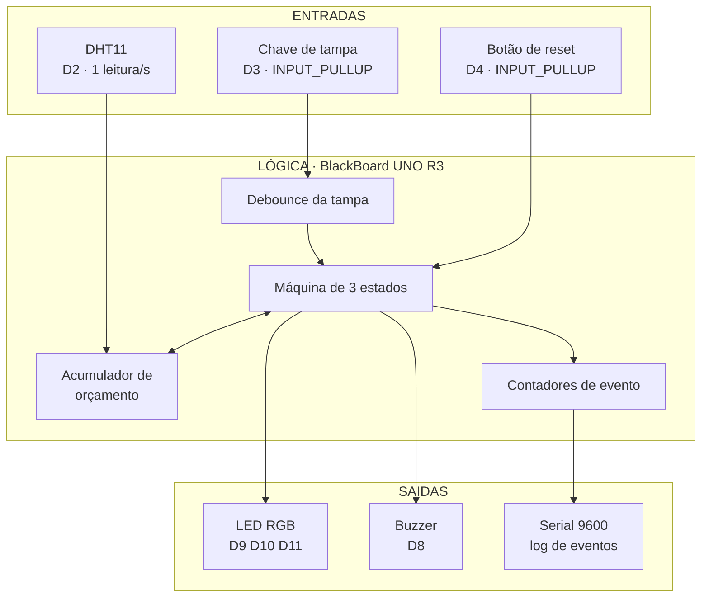
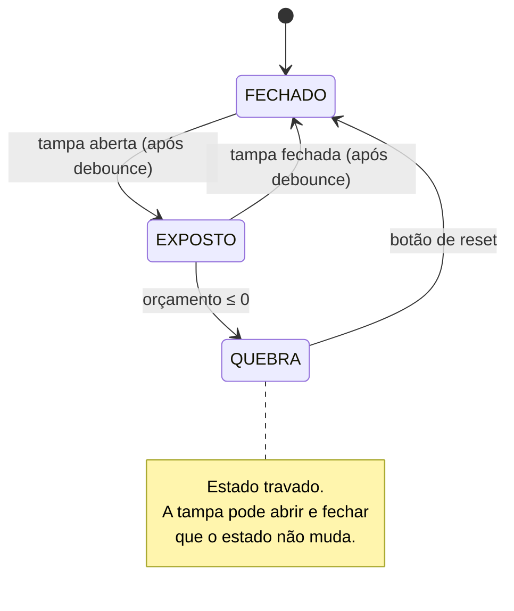

# Arquitetura inicial — Sentinela de Cadeia Fria

Detalhamento da seção 7 do [README](../README.md). Tudo aqui é **preliminar**: nada foi montado em bancada ainda.

## Visão geral

Um único laço de controle, sem interrupções e sem bibliotecas além da leitura do DHT11. O dispositivo é autônomo: o serial serve para registro e depuração, não é necessário para funcionar.



## Máquina de estados



### Detalhamento

| Estado | LED RGB | Buzzer | Orçamento | Saída do estado |
|---|---|---|---|---|
| **FECHADO** | verde fixo | silencioso | preservado | abertura da tampa |
| **EXPOSTO** | amarelo fixo | silencioso | sendo consumido | fechamento da tampa **ou** esgotamento |
| **QUEBRA** | vermelho piscando | alarme intermitente | zerado | apenas o botão de reset |

Duas decisões deliberadas:

**O orçamento não se recupera sozinho.** Uma vez consumido, permanece consumido até o reset. Modelar recuperação térmica (o produto voltando a esfriar dentro da caixa) exigiria conhecer a inércia da caixa, e não conhecemos. Fica como possível evolução na N2.

**A quebra trava.** Um alarme que se apaga sozinho quando a tampa fecha seria ignorado em campo. O operador precisa reconhecer o evento — e esse reconhecimento fica registrado.

## Orçamento de exposição

```
consumo(T) = 1 + (T − 20 °C) / 10        [unidades por segundo, mínimo 0]

orçamento inicial = 120 unidades          (PROVISÓRIO — ver tarefa 8)
```

| Temperatura ambiente | Consumo por segundo | Tempo até a quebra |
|---|---|---|
| 20 °C | 1,0 | 120 s |
| 25 °C | 1,5 | 80 s |
| 30 °C | 2,0 | 60 s |
| 35 °C | 2,5 | 48 s |
| 40 °C | 3,0 | 40 s |

A tabela é a melhor forma de explicar o conceito para quem não é da área: **na sombra você tem dois minutos, no sol você tem quarenta segundos.**

> O valor de 120 unidades é um chute educado. Substituí-lo por um número com respaldo é a tarefa 8, e é a dúvida nº 1 dirigida ao professor.

## Esboço do laço principal

Pseudocódigo, não é código final — a implementação é o trabalho das próximas aulas.

```
setup:
    configurar pinos
    orcamento = ORCAMENTO_INICIAL
    estado = FECHADO

loop, a cada 1 s:
    T = ler_dht11()
    tampa = ler_chave_com_debounce()

    se estado == FECHADO:
        se tampa aberta:
            estado = EXPOSTO
            registrar ABERTURA

    senão se estado == EXPOSTO:
        orcamento -= max(0, 1 + (T - 20) / 10)
        acumular T para a média
        se tampa fechada:
            estado = FECHADO
            registrar FECHAMENTO com duração, T média e orçamento restante
        senão se orcamento <= 0:
            estado = QUEBRA
            registrar QUEBRA

    senão se estado == QUEBRA:
        piscar vermelho + buzzer
        se botão de reset pressionado:
            orcamento = ORCAMENTO_INICIAL
            estado = FECHADO
            registrar RESET

    atualizar semáforo
```

## Formato do registro serial

Uma linha por evento, legível sem ferramenta nenhuma:

```
[00:00:00] INICIO           T=24C UR=55% orcamento=120.0
[00:01:12] ABERTURA   #1
[00:01:45] FECHAMENTO #1    dur=33s  Tmed=26.4C  consumo=42.1  restante=77.9
[00:03:02] ABERTURA   #2
[00:03:50] FECHAMENTO #2    dur=48s  Tmed=31.2C  consumo=101.8 restante=0.0
[00:03:50] QUEBRA           aberturas=2  exposicao_total=81s  Tmed=29.3C
[00:05:10] RESET            reconhecido pelo operador
```

Os tempos são relativos à energização da placa (`millis()`), não a um relógio real — não há RTC no kit. Correlacionar com o horário do dia depende de anotar quando a placa foi ligada. É uma limitação declarada, não um esquecimento.

## Pinagem preliminar

| Pino | Componente | Observação |
|---|---|---|
| D2 | DHT11 (dados) | resistor de pull-up pode ser necessário |
| D3 | Chave de tampa | `INPUT_PULLUP`, sem resistor externo |
| D4 | Botão de reset | `INPUT_PULLUP`, sem resistor externo |
| D8 | Buzzer | conferir se é ativo ou passivo — muda o acionamento |
| D9 | LED RGB — vermelho | PWM |
| D10 | LED RGB — verde | PWM |
| D11 | LED RGB — azul | PWM (não usado no semáforo, reservado) |

**A confirmar na bancada:**

- o LED RGB do kit é de **ânodo comum** ou **cátodo comum**? Inverte a lógica de acionamento.
- o buzzer é **ativo** (basta nível alto) ou **passivo** (precisa de `tone()`)? Muda a tarefa 12.
- valores de resistor disponíveis para o LED RGB.

## O que ficou de fora, e por quê

| Componente do kit | Por que não é usado |
|---|---|
| Sensor ultrassônico | detectaria a tampa por distância, mas a chave momentânea faz o mesmo com mais confiabilidade e menos código. Fica como comparação opcional. |
| Micro servo / Garra Ant | não há atuação física no escopo. Usá-los só para "aproveitar a peça" enfraqueceria o projeto. |

## Evoluções previstas (fora da N1)

- **Conectividade** — ESP8266/ESP32 no lugar da UNO, enviando eventos por Wi-Fi.
- **Persistência** — cartão SD + RTC, para registro independente do computador.
- **Recuperação do orçamento** — modelar o produto voltando a esfriar com a tampa fechada.
- **Sensor adequado à faixa fria** — DS18B20 dentro da caixa, medindo o conteúdo, complementando a medição de ambiente.
