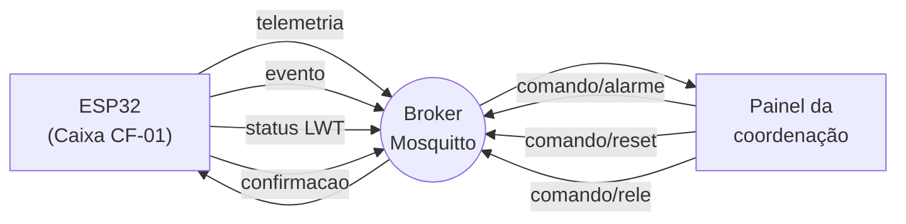
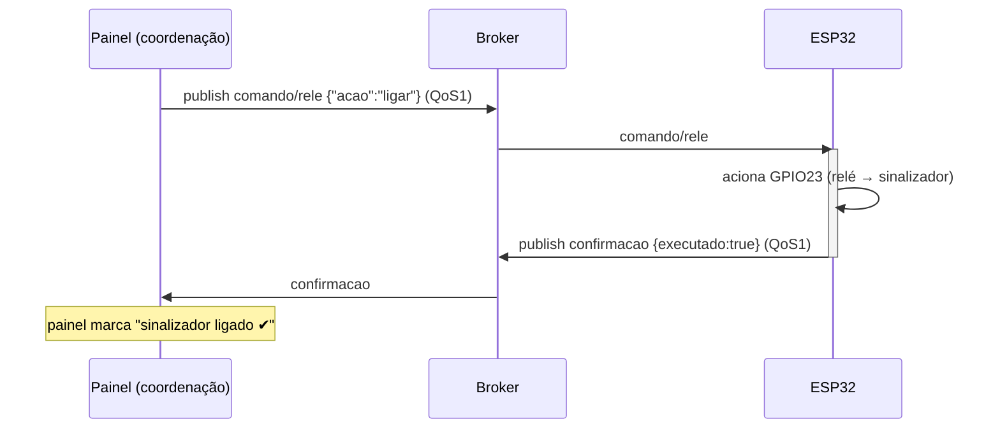

# Arquitetura MQTT — Sentinela de Cadeia Fria

Camada de rede do projeto: tópicos, formatos de mensagem, confirmação de comandos e comportamento de reconexão. Complementa [`arquitetura-inicial.md`](arquitetura-inicial.md).

## Broker

- **Desenvolvimento:** broker público de teste (`test.mosquitto.org:1883`) ou Mosquitto local.
- **Demonstração da N1:** **Mosquitto local** em um PC ou Raspberry Pi na mesma rede.
- **Cliente no ESP32:** biblioteca `PubSubClient` (ou `arduino-mqtt`), sobre `WiFi.h`.
- **QoS:** comandos e confirmações em **QoS 1** (entrega garantida); telemetria periódica em **QoS 0** (perder uma amostra de 5 s não é crítico).

## Mapa de tópicos

Prefixo base: **`sentinela/cadeia-fria`**. Um único dispositivo na N1; o prefixo já deixa espaço para múltiplas caixas depois (`sentinela/cadeia-fria/CF-02/...`).



| # | Tópico | Direção | QoS | Retained | Descrição |
|---|---|---|---|---|---|
| 1 | `sentinela/cadeia-fria/telemetria` | 📤 pub | 0 | não | leitura periódica (5 s) |
| 2 | `sentinela/cadeia-fria/evento` | 📤 pub | 1 | não | evento discreto da máquina de estados |
| 3 | `sentinela/cadeia-fria/status` | 📤 pub | 1 | **sim** | presença (`online`/`offline`) via *Last Will* |
| 4 | `sentinela/cadeia-fria/comando/alarme` | 📥 sub | 1 | não | disparar/silenciar buzzer |
| 5 | `sentinela/cadeia-fria/comando/reset` | 📥 sub | 1 | não | resetar a QUEBRA remotamente |
| 6 | `sentinela/cadeia-fria/comando/rele` | 📥 sub | 1 | não | ligar/desligar o sinalizador de retenção |
| 7 | `sentinela/cadeia-fria/confirmacao` | 📤 pub | 1 | não | ACK de qualquer comando recebido |

## Formatos de mensagem (JSON)

### 1. Telemetria — `.../telemetria`
```json
{
  "ts": 73421,
  "estado": "EXPOSTO",
  "temp": 31.2,
  "umid": 58,
  "orcamento": 44.8,
  "aberturas": 2,
  "rssi": -67
}
```

### 2. Evento — `.../evento`
```json
{
  "ts": 73421,
  "evento": "FECHAMENTO",
  "n": 2,
  "dur_s": 48,
  "t_med": 31.2,
  "consumo": 101.8,
  "restante": 0.0
}
```
`evento` ∈ `{ABERTURA, FECHAMENTO, QUEBRA, RESET}`.

### 3. Status (LWT) — `.../status`
Payload de texto simples, **retained**: `online` (publicado ao conectar) ou `offline` (o *Last Will* que o broker publica sozinho se o ESP32 sumir).

### 4–6. Comandos — `.../comando/*`
```json
// comando/alarme
{ "acao": "disparar" }     // ou "silenciar"

// comando/reset
{ "acao": "reset" }

// comando/rele
{ "acao": "ligar" }        // ou "desligar"
```

### 7. Confirmação — `.../confirmacao`
Publicada pelo ESP32 imediatamente após executar (ou recusar) um comando:
```json
{
  "comando": "rele",
  "acao": "ligar",
  "recebido_ts": 73500,
  "executado": true,
  "estado_resultante": "sinalizador=ligado"
}
```
`executado: false` cobre o caso de comando inválido ou não aplicável (ex.: `reset` fora do estado QUEBRA), com o motivo em `estado_resultante`.

## Fluxo de comando com confirmação



O painel **não assume** que o comando funcionou só porque publicou — ele espera a mensagem em `confirmacao`. Se a confirmação não chegar em alguns segundos, sinaliza "comando não confirmado" para a coordenação.

## Reconexão e resiliência

A rede vai cair — é premissa do projeto (RISCO-02), não exceção. Três mecanismos:

1. **Wi-Fi não bloqueante.** O loop verifica `WiFi.status()`; se caiu, dispara `WiFi.reconnect()` sem travar a lógica local. Meta: reconectar em < 15 s após o AP voltar.
2. **Reconexão MQTT com backoff.** Se `mqtt.connected()` for falso, tenta reconectar em intervalos crescentes (1 s, 2 s, 4 s… até um teto), reassinando todos os `comando/*` a cada reconexão.
3. **Last Will + presença.** Ao conectar, publica `status=online` (retained). O *Last Will* registrado no broker publica `status=offline` (retained) automaticamente se o ESP32 desaparecer sem se despedir. Assim o painel distingue **"caixa em silêncio porque está tudo verde"** de **"caixa sumiu da rede"** — meta: refletir `offline` em < 10 s.

> Enquanto sem rede, a máquina de estados, o semáforo e o buzzer continuam operando. A telemetria perdida nesse intervalo **não** é bufferizada na N1 — o store-and-forward é evolução da N2 (RISCO-02).

## Segurança (nota para a N2)

Na N1, broker local sem autenticação, rede controlada. Para uso real: usuário/senha no broker, TLS (porta 8883) e tópicos por dispositivo com ACL, de modo que uma caixa não publique nem assine no espaço de outra. Fora do escopo da N1, registrado para não ser esquecido.
