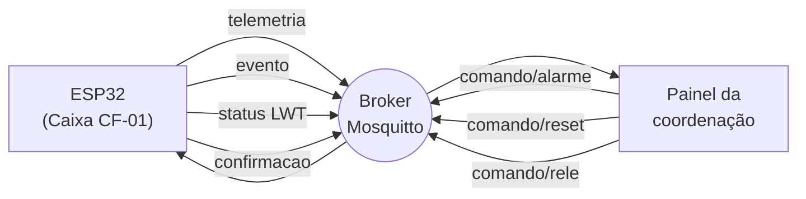
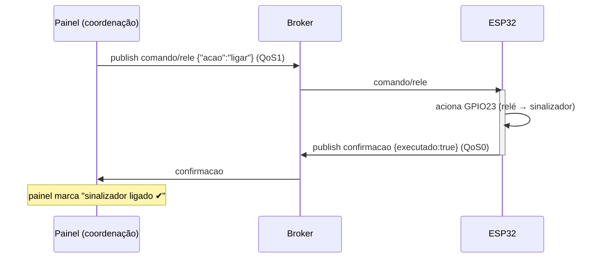

# Arquitetura MQTT — Sentinela de Cadeia Fria

Camada de rede do projeto: tópicos, formatos de mensagem, confirmação de comandos e comportamento de reconexão. Complementa [`arquitetura-inicial.md`](arquitetura-inicial.md).

## Broker

- **Desenvolvimento:** broker público (`broker.hivemq.com:1883`) ou Mosquitto local. O `test.mosquitto.org` foi descartado em teste — derrubava a sessão a cada poucos segundos sob carga.
- **Demonstração da N1:** **Mosquitto local** em um PC ou Raspberry Pi na mesma rede.
- **Cliente no ESP32:** biblioteca `PubSubClient` (ou `arduino-mqtt`), sobre `WiFi.h`.
- **QoS:** assinatura dos comandos e *Last Will* em **QoS 1**; todas as publicações do dispositivo saem em **QoS 0** — ver a nota de implementação adiante.

## Mapa de tópicos

Prefixo base: **`sentinela/cadeia-fria`**. Um único dispositivo na N1; o prefixo já deixa espaço para múltiplas caixas depois (`sentinela/cadeia-fria/CF-02/...`).


```mermaid
flowchart LR
    DEV["ESP32<br/>(Caixa CF-01)"]
    BR(("Broker<br/>Mosquitto"))
    PANEL["Painel da<br/>coordenação"]

    DEV -->|telemetria| BR
    DEV -->|evento| BR
    DEV -->|status LWT| BR
    DEV -->|confirmacao| BR
    BR --> PANEL

    PANEL -->|comando/alarme| BR
    PANEL -->|comando/reset| BR
    PANEL -->|comando/rele| BR
    BR --> DEV
```

| # | Tópico | Direção | QoS | Retained | Descrição |
|---|---|---|---|---|---|
| 1 | `sentinela/cadeia-fria/telemetria` | 📤 pub | 0 | não | leitura periódica (5 s) |
| 2 | `sentinela/cadeia-fria/evento` | 📤 pub | 0 ¹ | não | evento discreto da máquina de estados |
| 3 | `sentinela/cadeia-fria/status` | 📤 pub | 0 ¹ | **sim** | presença (`online`/`offline`); o *Last Will* é registrado em QoS 1 |
| 4 | `sentinela/cadeia-fria/comando/alarme` | 📥 sub | 1 | não | disparar/silenciar buzzer |
| 5 | `sentinela/cadeia-fria/comando/reset` | 📥 sub | 1 | não | resetar a QUEBRA remotamente |
| 6 | `sentinela/cadeia-fria/comando/rele` | 📥 sub | 1 | não | ligar/desligar o sinalizador de retenção |
| 7 | `sentinela/cadeia-fria/confirmacao` | 📤 pub | 0 ¹ | não | ACK de qualquer comando recebido |

¹ QoS real do firmware atual, abaixo do previsto no projeto original — ver a nota a seguir.

### Nota de implementação (QoS)

A biblioteca **`PubSubClient`** publica exclusivamente em **QoS 0**: o parâmetro de QoS existe apenas na assinatura e no registro do *Last Will*. O projeto previa QoS 1 para evento, status e confirmação; o que o firmware entrega é:

| Operação | QoS previsto | QoS real | Suportado pela biblioteca |
|---|---|---|---|
| Assinatura de `comando/+` | 1 | **1** | sim |
| *Last Will* (registrado no CONNECT) | 1 | **1** | sim |
| Publicações do dispositivo | 1 | **0** | não |

**Consequência prática:** uma confirmação perdida na rede não é retransmitida pelo broker. Isso não deixa o painel em estado inconsistente, porque ele já não assume sucesso pelo simples fato de ter publicado o comando — ele aguarda a mensagem em `confirmacao` e, na ausência dela, sinaliza "comando não confirmado" para a coordenação. A perda vira um alerta visível, não uma falha silenciosa.

**Encaminhamento:** elevar as publicações a QoS 1 exige trocar de biblioteca (por exemplo `arduino-mqtt`, que implementa QoS 1 e 2 na publicação). Avaliação registrada para a N2, junto com autenticação e TLS.

## Formatos de mensagem (JSON)

### 1. Telemetria — `.../telemetria`
```json
{
  "ts": 73421,
  "estado": "EXPOSTO",
  "temp": 31.2,
  "umid": 58,
  "orcamento": 44.8,
  "aberturas": 2,
  "rssi": -67
}
```

### 2. Evento — `.../evento`
```json
{
  "ts": 73421,
  "evento": "FECHAMENTO",
  "n": 2,
  "dur_s": 48,
  "t_med": 31.2,
  "consumo": 101.8,
  "restante": 0.0
}
```
`evento` ∈ `{ABERTURA, FECHAMENTO, QUEBRA, RESET}`.

### 3. Status (LWT) — `.../status`
Payload de texto simples, **retained**: `online` (publicado ao conectar) ou `offline` (o *Last Will* que o broker publica sozinho se o ESP32 sumir).

### 4–6. Comandos — `.../comando/*`
```json
// comando/alarme
{ "acao": "disparar" }     // ou "silenciar"

// comando/reset
{ "acao": "reset" }

// comando/rele
{ "acao": "ligar" }        // ou "desligar"
```

### 7. Confirmação — `.../confirmacao`
Publicada pelo ESP32 imediatamente após executar (ou recusar) um comando:
```json
{
  "comando": "rele",
  "acao": "ligar",
  "recebido_ts": 73500,
  "executado": true,
  "estado_resultante": "sinalizador=ligado"
}
```
`executado: false` cobre o caso de comando inválido ou não aplicável (ex.: `reset` fora do estado QUEBRA), com o motivo em `estado_resultante`.

## Fluxo de comando com confirmação


```mermaid
sequenceDiagram
    participant P as Painel (coordenação)
    participant B as Broker
    participant D as ESP32

    P->>B: publish comando/rele {"acao":"ligar"} (QoS1)
    B->>D: comando/rele
    activate D
    D->>D: aciona GPIO23 (relé → sinalizador)
    D->>B: publish confirmacao {executado:true} (QoS0)
    deactivate D
    B->>P: confirmacao
    Note over P: painel marca "sinalizador ligado ✔"
```

O painel **não assume** que o comando funcionou só porque publicou — ele espera a mensagem em `confirmacao`. Se a confirmação não chegar em alguns segundos, sinaliza "comando não confirmado" para a coordenação.

## Reconexão e resiliência

A rede vai cair — é premissa do projeto (RISCO-02), não exceção. Três mecanismos:

1. **Wi-Fi não bloqueante.** A cada volta do laço, `manterWifi()` verifica `WiFi.status()`. Se caiu, dispara um novo `WiFi.begin(WIFI_SSID, WIFI_PASSWORD)` a cada `WIFI_RETENTA_MS` (5 s) — sem `while` nem `delay`, de modo que a máquina de estados, o semáforo e o buzzer continuam operando durante a queda. As transições (`conectado` / `conexão caiu` / `tentando conectar`) são registradas no serial, o que serve de evidência do requisito. Meta: reconectar em < 15 s após o AP voltar.
2. **Reconexão MQTT com backoff.** Se `mqtt.connected()` for falso, tenta reconectar em intervalos crescentes (1 s, 2 s, 4 s… até um teto), reassinando todos os `comando/*` a cada reconexão.
3. **Last Will + presença.** Ao conectar, publica `status=online` (retained). O *Last Will* registrado no broker publica `status=offline` (retained) automaticamente se o ESP32 desaparecer sem se despedir. Assim o painel distingue **"caixa em silêncio porque está tudo verde"** de **"caixa sumiu da rede"**. O broker declara a ausência após ~1,5× o *keep-alive*: com os 15 s usados hoje, o `offline` aparece em ~22 s. Medição no simulador mostrou que valores menores derrubavam a sessão por `PINGRESP` atrasado; em rede local, onde a latência é mínima, 6 s trazem a detecção para ~9 s.

> Enquanto sem rede, a máquina de estados, o semáforo e o buzzer continuam operando. A telemetria perdida nesse intervalo **não** é bufferizada na N1 — o store-and-forward é evolução da N2 (RISCO-02).

## Segurança (nota para a N2)

Na N1, broker local sem autenticação, rede controlada. Para uso real: usuário/senha no broker, TLS (porta 8883) e tópicos por dispositivo com ACL, de modo que uma caixa não publique nem assine no espaço de outra. Fora do escopo da N1, registrado para não ser esquecido.
